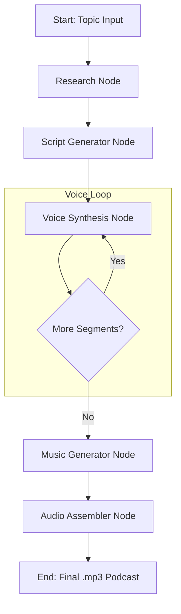

# PodcastGen-Agent: An Agentic Multimodal System for Autonomous Podcast Generation


A **fully autonomous, multimodal AI system** using only open-source models and free-tier infrastructure.

The system takes a single topic and orchestrates a series of generative models to produce a complete, ready-to-use podcast episode with host/guest dialogue, natural speech synthesis, and background music.

## Key Features

- **Fully Autonomous Pipeline**: From a single text input to a final `.mp3` podcast with zero human intervention.
- **Agentic Orchestration**: Leverages LangGraph to create a robust, stateful, and cyclical workflow, enabling tasks like looping through dialogue segments and conditional routing.
- **Multimodal Generation**: Seamlessly integrates multiple AI capabilities:
  - **Research**: Web search (DuckDuckGo) for topic information gathering.
  - **Script Writing**: LLM (Qwen2.5-7B) for natural host/guest dialogue.
  - **Voice Synthesis**: Text-to-Speech (XTTS-v2) with distinct voices for host and guest.
  - **Music Generation**: Text-to-Music (MusicGen) for intro/outro jingles.
- **Resource & Cost Optimization**: Designed to run on free-tier GPU platforms like Kaggle or Google Colab. Uses 4-bit model quantization and aggressive memory management to fit within VRAM constraints (~6GB).

## Architecture & Tech Stack

The core of this project is a stateful graph managed by **LangGraph**. The graph defines a clear, modular flow, making the system easy to debug, extend, and scale.

### Core Technologies

| Component           | Library                                |
|---------------------|----------------------------------------|
| Orchestration       | `langgraph`                            |
| LLM & Transformers  | `transformers`, `bitsandbytes` (4-bit) |
| Text-to-Speech      | `TTS` (Coqui XTTS-v2)                  |
| Music Generation    | Hugging Face `transformers` (MusicGen)  |
| Audio Assembly      | `pydub`, `scipy`                       |
| Core Framework      | `torch`                                |


### Agentic Workflow Diagram



## Quick Start

### Prerequisites

- Python 3.10 or newer
- **ffmpeg** installed and available on your `PATH` (required for mp3 export via pydub)
- NVIDIA GPU recommended (set `PODCAST_ALLOW_CPU=true` to force CPU mode, which is very slow)
- Accept the Coqui XTTS license: `set COQUI_TOS_AGREED=1` on Windows or `export COQUI_TOS_AGREED=1` on Linux/macOS

### Install

```bash
pip install -r requirements.txt
pip install -e .

# optional dev tooling
pip install -r requirements-dev.txt
```

### Generate a podcast

```bash
python -m podcast_gen_agent.main "The Future of Artificial Intelligence"

# custom duration (minutes)
python -m podcast_gen_agent.main "Climate Change" --duration 10

# reproducible run
python -m podcast_gen_agent.main "Robotics" --seed 42

# resume an interrupted run
python -m podcast_gen_agent.main --resume <run_id>
```

Each run writes artifacts under `outputs/<run_id>/`: segment wavs, transcript, RSS feed, and a `run_manifest.json` with per-node timings and an estimated GPU cost.

### Health API (for Docker)

```bash
uvicorn podcast_gen_agent.api:app --host 0.0.0.0 --port 8000
```

Endpoints: `GET /health`, `GET /ready`

### Docker Compose

```bash
docker compose up api
```

### Configuration

Environment variables (all optional):

| Variable | Default | Description |
|----------|---------|-------------|
| `PODCAST_OUTPUT_DIR` | `./outputs` | Output directory |
| `PODCAST_ALLOW_CPU` | `false` | Allow CPU-only execution |
| `PODCAST_LLM_MODEL` | `Qwen/Qwen2.5-7B-Instruct` | Script LLM |
| `PODCAST_TTS_MODEL` | `xtts_v2` path | TTS model |
| `PODCAST_HOST_VOICE` | `Claribel Dervla` | Host speaker |
| `PODCAST_GUEST_VOICE` | `Daisy Studious` | Guest speaker |
| `PODCAST_LOG_LEVEL` | `INFO` | Log level |
| `COQUI_TOS_AGREED` | unset | Must be `1` for XTTS |

**Google Colab**: Upload `podcast_gen_colab.ipynb`, select a **GPU runtime** (T4 is fine), and run all cells in order.

Colab notes:
- Use the notebook install cell (not `requirements.txt` directly). Colab already ships its CUDA-enabled PyTorch stack.
- The notebook pins `coqui-tts==0.27.5`, `transformers==4.57.5`, and `tokenizers==0.22.1`.
- MusicGen runs through Hugging Face Transformers because Audiocraft 1.3 is incompatible with current Colab Python and PyTorch versions.
- Warnings about `gradio` or `langchain` version conflicts are safe to ignore.
- If install fails, use **Runtime → Restart session** and re-run from cell 1.

If XTTS or MusicGen cannot initialize, the pipeline uses local eSpeak speech
and generated musical stings so that it can still produce an MP3.

Generated files are written to `outputs/<run_id>/podcast_*.mp3`, not directly under `outputs/`.

## Future Directions

This project establishes a foundation for fully autonomous multimodal agents using only open-source models for resource-constrained environments.

### 1. LLM-as-a-Critic Self-Correction Loop
- **Critique Node**: Add a `script_critic_node` powered by an LLM to evaluate generated scripts for quality, coherence, and engagement.
- **Conditional Routing**: If `score > 8`, proceed to voice synthesis. Otherwise, route back to regenerate with feedback.
- **RLAIF**: Use critic scores as reward signals for preference fine-tuning via Direct Preference Optimization.

### 2. SOTA Model Upgrades
| Current        | Upgrade To                  | Why                     |
|----------------|-----------------------------|-------------------------|
| Qwen2.5-7B     | Qwen2.5-14B or Llama-3.1-8B | Better dialogue quality |
| XTTS-v2        | Bark or StyleTTS2           | More natural prosody    |
| MusicGen-small | MusicGen-large              | Higher quality music    |

### 3. Enhanced Audio Features
- **Sound Effects**: Add ambient sounds (intro jingles, transitions, audience applause).
- **Voice Cloning**: Clone specific voice samples for consistent host identity.
- **Dynamic Pacing**: Vary speech speed based on content (slower for emphasis, faster for lists).

### 4. Multi-Format Output
- **Video Podcasts**: Generate waveform visualizations or AI-generated host avatars.
- **Transcripts**: Auto-generate timestamped transcripts for accessibility.
- **RSS Feed**: Automatic podcast feed generation for distribution.
