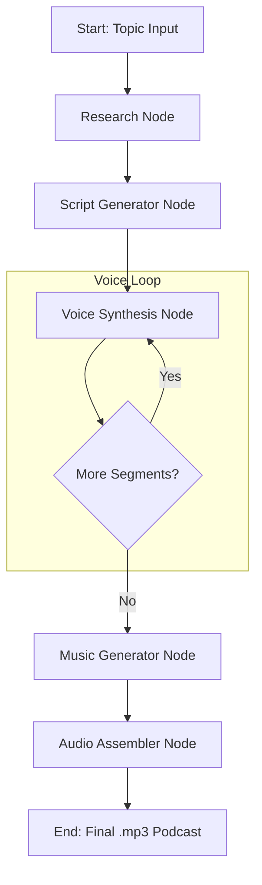

# PodcastGen-Agent: An Agentic Multimodal System for Autonomous Podcast Generation


A **fully autonomous, multimodal AI system** using only open-source models and free-tier infrastructure.

The system takes a single topic and orchestrates a series of generative models to produce a complete, ready-to-use podcast episode with host/guest dialogue, natural speech synthesis, and background music.

## Key Features

- **Fully Autonomous Pipeline**: From a single text input to a final `.mp3` podcast with zero human intervention.
- **Agentic Orchestration**: Leverages LangGraph to create a robust, stateful, and cyclical workflow, enabling tasks like looping through dialogue segments and conditional routing.
- **Multimodal Generation**: Seamlessly integrates multiple AI capabilities:
  - **Research**: Web search (DuckDuckGo) for topic information gathering.
  - **Script Writing**: LLM (Qwen2.5-7B) for natural host/guest dialogue.
  - **Voice Synthesis**: Text-to-Speech (XTTS-v2) with distinct voices for host and guest.
  - **Music Generation**: Text-to-Music (MusicGen) for intro/outro jingles.
- **Resource & Cost Optimization**: Designed to run on free-tier GPU platforms like Kaggle or Google Colab. Uses 4-bit model quantization and aggressive memory management to fit within VRAM constraints (~6GB).

## Architecture & Tech Stack

The core of this project is a stateful graph managed by **LangGraph**. The graph defines a clear, modular flow, making the system easy to debug, extend, and scale.

### Core Technologies

| Component           | Library                                |
|---------------------|----------------------------------------|
| Orchestration       | `langgraph`                            |
| LLM & Transformers  | `transformers`, `bitsandbytes` (4-bit) |
| Text-to-Speech      | `TTS` (Coqui XTTS-v2)                  |
| Music Generation    | `audiocraft` (MusicGen)                |
| Audio Assembly      | `pydub`, `scipy`                       |
| Core Framework      | `torch`                                |


### Agentic Workflow Diagram



## Quick Start

```bash
# install dependencies
pip install -r requirements.txt

# generate a podcast
python -m podcast_gen_agent.main "The Future of Artificial Intelligence"

# custom duration (minutes)
python -m podcast_gen_agent.main "Climate Change" --duration 10
```

**Google Colab**: Upload `podcast_gen_colab.ipynb` and run all cells.

## Future Directions

This project establishes a foundation for fully autonomous multimodal agents using only open-source models for resource-constrained environments.

### 1. LLM-as-a-Critic Self-Correction Loop
- **Critique Node**: Add a `script_critic_node` powered by an LLM to evaluate generated scripts for quality, coherence, and engagement.
- **Conditional Routing**: If `score > 8`, proceed to voice synthesis. Otherwise, route back to regenerate with feedback.
- **RLAIF**: Use critic scores as reward signals for preference fine-tuning via Direct Preference Optimization.

### 2. SOTA Model Upgrades
| Current        | Upgrade To                  | Why                     |
|----------------|-----------------------------|-------------------------|
| Qwen2.5-7B     | Qwen2.5-14B or Llama-3.1-8B | Better dialogue quality |
| XTTS-v2        | Bark or StyleTTS2           | More natural prosody    |
| MusicGen-small | MusicGen-large              | Higher quality music    |

### 3. Enhanced Audio Features
- **Sound Effects**: Add ambient sounds (intro jingles, transitions, audience applause).
- **Voice Cloning**: Clone specific voice samples for consistent host identity.
- **Dynamic Pacing**: Vary speech speed based on content (slower for emphasis, faster for lists).

### 4. Multi-Format Output
- **Video Podcasts**: Generate waveform visualizations or AI-generated host avatars.
- **Transcripts**: Auto-generate timestamped transcripts for accessibility.
- **RSS Feed**: Automatic podcast feed generation for distribution.
